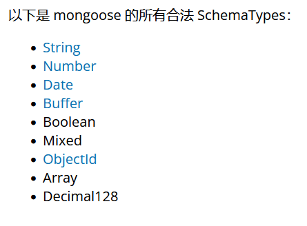
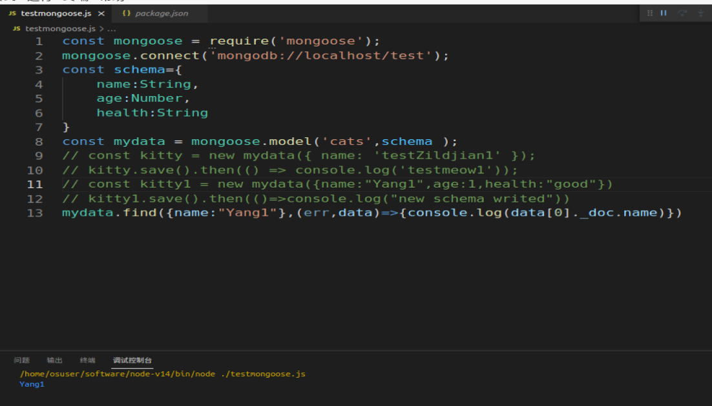
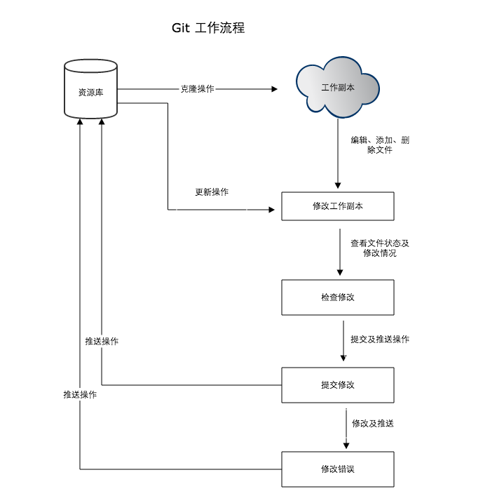
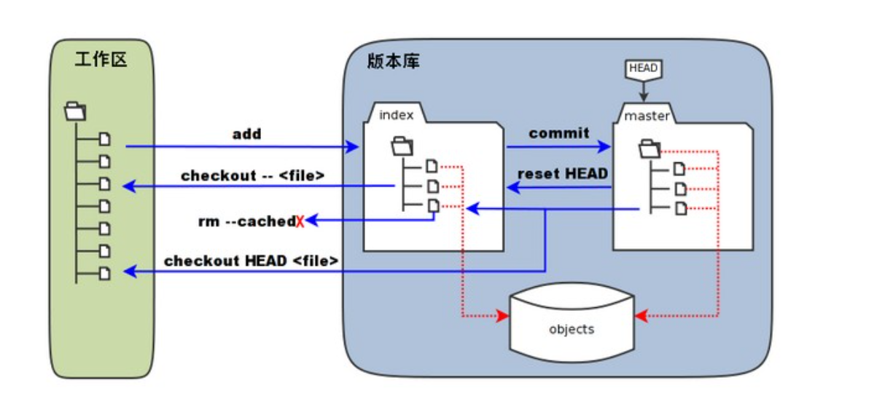
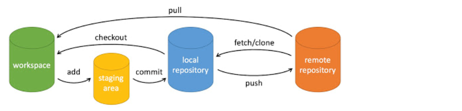
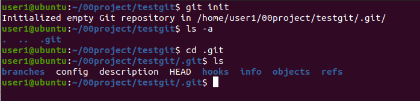

# mongoose使用

## 1. 安装

创建node.js项目，安装mongoose：

```
npm install mongoose
```

要求已经安装并打开了mongodb服务器   mongod --dbpath /home/user1/mongodbData

## 2. 使用流程

### 2.1 引入mongoose

```
const mongoose = require('mongoose'); 
```

### 2.2 连接数据库

```
mongoose.connect('mongodb://localhost/test');
```

其中,test是数据库名。

### 2.3 创建schema

```
const schema={
    name:String,
    age:Number,
    health:String
}
```

mongoose有自己的基本数据类型定义：



创建的schema生效后，存储到数据库的数据必须遵守，否则不能存储，但系统没有原生的错误提示，只是存储一个空数据。

### 2.4 创建一个model

```
const Cat = mongoose.model('Cat',schema)
```

2.5 写入数据库

```
kitty1.save()
```

写入数据集的名称：是定义model的第一个参数，并且进行了修改：保证是英文的复数形式（自动在最后加s，如果没有的话。），不区分大小写，全部用小写字母。

2.6 数据查询

```
model名.find(查询条件),callback(err,查询结果)=>{})
```



查询结果是一个Array，data[0]._doc是查询出的文档。

# git的使用

## 1.git的安装

使用库安装


sudo apt update

sudo apt-get install git

测试  git --version

## 2.git工作流程



概念

工作区：就是你在电脑里能看到的目录。
暂存区：英文叫 stage 或 index。一般存放在 .git 目录下的 index 文件（.git/index）中，所以我们把暂存区有时也叫作索引（index）。
版本库：工作区有一个隐藏目录 .git，这个不算工作区，而是 Git 的版本库。

下面这个图展示了工作区、版本库中的暂存区和版本库之间的关系：



操作过程



## 2.git常用命令

1)git项目创建

新建一个目录，在此目录下执行：git init

执行后会创建一个隐藏.git目录:




